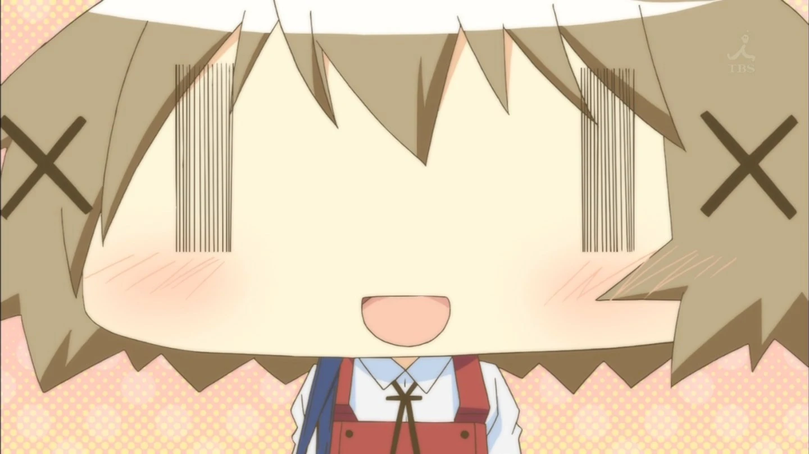

# Yuno



This program allows you to extract the strings from the game [Hidamari Sketch Dokodemo Sugoroku × 365](https://datomatic.no-intro.org/index.php?page=show_record&s=28&n=3378) on Nintendo DS. It also allows to reinject them back in, useful if you plan on translating the game.

## Usage

```bash
$ yuno <rom>.nds -e <file>
```
Will create a file named "&lt;file&gt;.sae" containing the strings with their offsets.

```bash
$ yuno <rom>.nds -p <file>
```
Will update the rom with the strings inside "&lt;file&gt;.sae".

## TODO

- There are a few strings that are not dialogues that are not extracted.
- Deduplicate lines to expand the space (some strings are duplicated more than 50 times)
